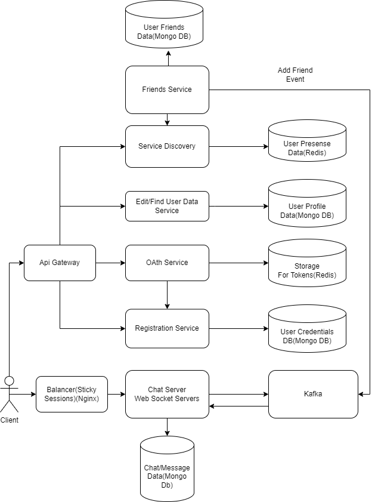

# Домашнее задание 1

Требуется спроектировать приложение мессенджер

## Архитектура

### OAuth Service
http(для простоты) cервис выдачи временного токена. 
DB: Redis. In memory хранилище для быстрого поиска и проверки токена 
на валидность другими сервисами.

API:
авторизация с получением токена

### Registration Service
http(для простоты) сервис регистрации пользователя

API:
добавление нового пользователя

### Edit/Find User Data
http/grpc сервис по редактированию данных и поиску пользователя.

API:
Редактирование, удаление данных возможно только через токен. Уникальный nickname 
для простоты редактировать нельзя

### Friends Service
http/grpc сервис для добавления, удаления друзей. Работает через токен.

БД:
KV storage. Подойдет MongoDb, т.к. данные по каждому пользователю будут 
лежать внутри шарда

При попытке добавить пользователя A проверяет, если пользователь
A в онлайне, кидает в kafka и пишет в DB. 

### Service Discovery
http/grpc сервис обнаружения онлайн пользователей.

БД:
Redis для быстрого обновления статуса пользователей.

